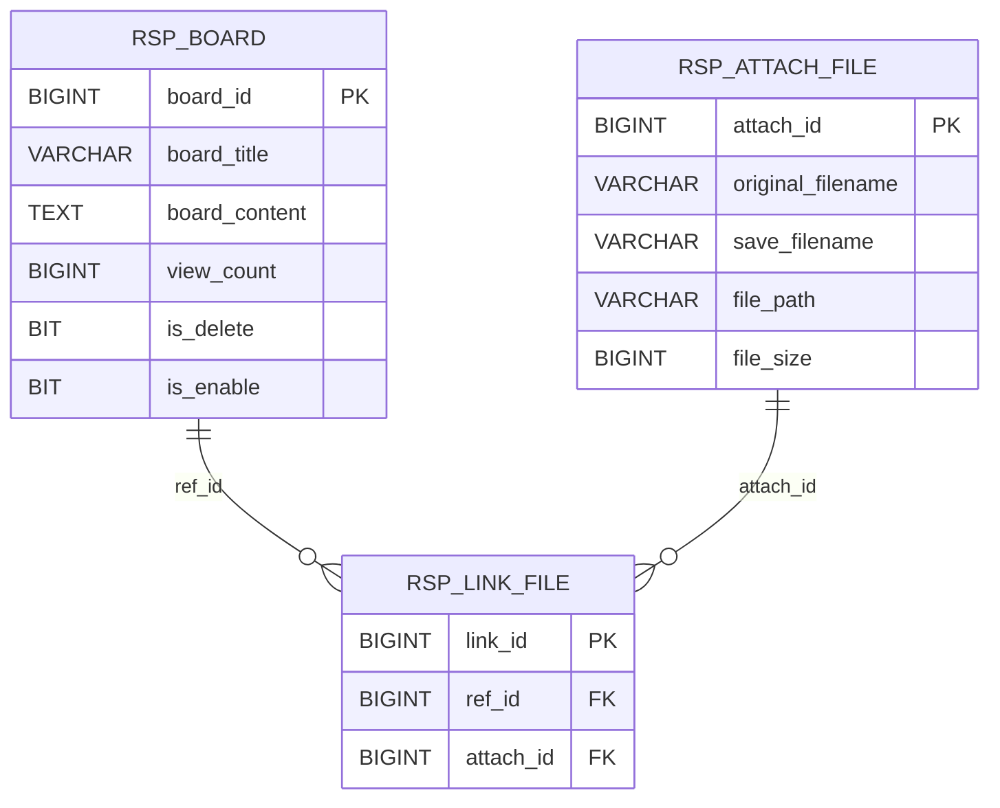

# Spring Boot 게시판 API 프로젝트

## 📘 1. 프로젝트 소개
Spring Boot와 JPA를 활용한 RESTful 게시판 API입니다.
게시글 CRUD 및 파일 첨부 기능을 제공합니다.

## 🧰 2. 기술 스택
- **Language**: Java 17
- **Framework**: Spring Boot 3.5.3
- **ORM**: Spring Data JPA + Hibernate
- **Query**: QueryDSL
- **Database**: SQL Server
- **Build Tool**: Gradle 8.14.3

## 📁 3. 프로젝트 구조
```
src/main/java/com/rsp/platform/
├── BoardApiApplication.java
├── common/
│   ├── config/WebConfig.java
│   ├── exception/
│   └── util/CommonUtils.java
├── config/QueryDslConfig.java
└── domain/
    ├── board/
    │   ├── controller/BoardController.java
    │   ├── service/BoardService.java
    │   ├── repository/
    │   ├── entity/BoardEntity.java
    │   └── dto/
    └── file/
        ├── service/FileStorageService.java
        ├── repository/
        ├── entity/
        └── dto/
```

## 🚀 4. 실행 방법
```bash
# 애플리케이션 실행
./gradlew bootRun

# JAR 빌드
./gradlew bootJar
```

## ✨ 5. 기능 요약
- 게시글 CRUD (등록/조회/수정/삭제)
- 파일 첨부 및 관리
- 동적 검색 (제목/내용/날짜)
- 페이징 처리
- 조회수 관리

## 📋 6. API 명세
**Base URL**: `http://localhost:8080/api`

- `GET /boards` - 게시글 목록 조회
- `GET /boards/{boardId}` - 게시글 상세 조회
- `POST /boards` - 게시글 등록
- `PUT /boards/{boardId}` - 게시글 수정
- `DELETE /boards/{boardId}` - 게시글 삭제

## 🗄️ 7. ERD
